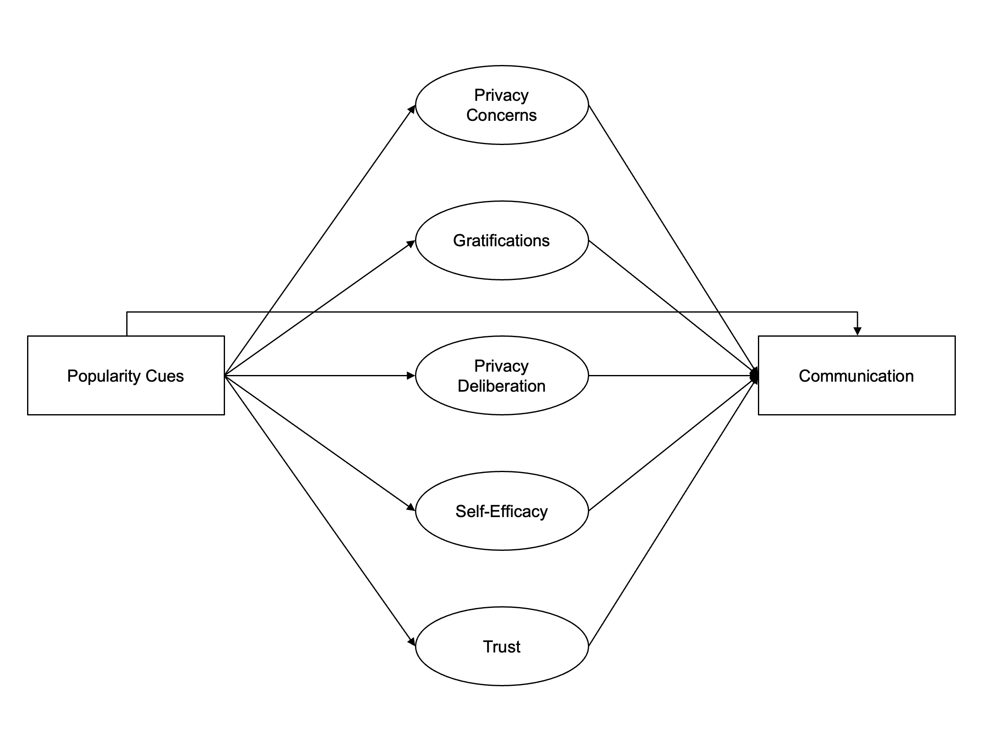
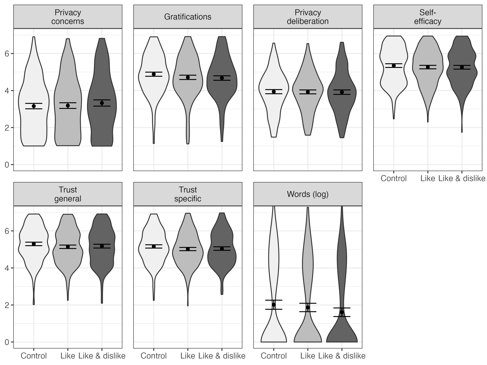

```{r include=F}
knitr::opts_chunk$set(
  cache=F, 
  echo=F, 
  warning=F, 
  message=F
  )
options(
  digits = 2
)
```

```{r setup, include=F}
# install github packages
# devtools::install_github("tdienlin/td@v.0.0.2.3")

# load packages
pcks <- c(
  "devtools", 
  "english",
  "jpeg", 
  "knitr", 
  "lavaan", 
  "magrittr", 
  "papaja", 
  "png", 
  "pwr", 
  "semTools", 
  "td", 
  "tidyverse"
  )

invisible(
  lapply(
    pcks, 
    library, 
    character.only = TRUE
    )
  )

# create bib with r-packages
r_refs(file = "bibliography/r-references.bib")

# load bib
r_citations <- 
  cite_r(
    "bibliography/r-references.bib"
    , footnote = FALSE
    , withhold = FALSE
    , pkgs = c(
      "brms"
      , "tidyverse"
      , "lavaan"
      , "marginaleffects"
      , "papaja" 
      , "pwr"
      , "quanteda"
      , "semTools"
      )
    )
```

```{r load-data, cache=F, include=F}
load("data/workspace.rData")
```

# Introduction

<!-- Understanding why people share personal information online is important.  -->
According to the privacy paradox, the way users share information online is erratic [@barnesPrivacyParadoxSocial2006]:
<!-- Personal beliefs, privacy concerns, or behavioral attitudes do not affect online behavior. -->
<!-- [for an overview of the privacy paradox, see @dienlinPrivacyParadoxAus2019].  -->
People communicate vast amounts of personal information online, although they are concerned about their privacy [@taddickenUsesPrivacyOnline2011].
However, despite its popularity in both academic research [@dienlinPrivacyParadoxAus2019] and the public press [@newyorkpublicradioPrivacyParadox2018], empirical support for the privacy paradox is weak [@baruhOnlinePrivacyConcerns2017; @dienlinDoesPrivacyParadox2021]. 
<!-- , which shows that privacy concerns are indeed related to communication online.  -->
<!-- Rather than further pursuing the privacy paradox,  -->
Research is therefore increasingly building on the privacy calculus model, which states that communication online can be explained successfully by perceived risks and expected benefits [@bolUnderstandingEffectsPersonalization2018b; @krasnovaOnlineSocialNetworks2010; @meierPrivacyCalculusRevisited2022].
<!-- Several studies have shown that experiencing more privacy risks or concerns is related to sharing less information online [@bolUnderstandingEffectsPersonalization2018b; @meierPrivacyCalculusRevisited2022], while expecting more benefits is related to sharing more information online [@heirmanPredictingAdolescentsDisclosure2013; @koohikamaliInvestigationDynamicModel2019]. -->

Although the privacy calculus has gained momentum in academic research, several important questions remain unanswered. 
First, we still know little about how the privacy calculus and online communication can be affected by external affordances [@bazarovaIntegrationIndividualisticNetworked2020; @braunlichLinkingLooseEnds2020].
For example, do popularity cues such as like and dislike buttons affect the privacy calculus and online communication?
<!-- I therefore analyze whether the privacy calculus is affected by the affordances of a website.  -->
<!-- Specifically, I investigate whether *popularity cues* such as like and dislike buttons affect the privacy calculus and whether they foster communication online. -->
Second, the privacy calculus' empirical foundation needs to be improved [@knijnenburgDeathPrivacyCalculus2017]. 
To date, much research on the privacy calculus builds on (a) self-reports of behavior [@krasnovaOnlineSocialNetworks2010], (b) vignette approaches [@bolUnderstandingEffectsPersonalization2018b], or (c) one-shot experiments in the lab [@treptePrivacyCalculusContextualized2020]. 
Can the privacy calculus be replicated in more authentic and long-term settings using actual behavioral data?
Third, research on the privacy calculus so far did not measure the actual process of weighing pros and cons [@knijnenburgDeathPrivacyCalculus2017], 
<!-- According to critics , showing that both concerns and gratifications correlate with communication behavior online is not sufficient evidence for an explicit weighing process.  -->
<!-- In this study I will thus focus on the explicit process of comparing pros and cons  -->
which I do in this study by elaborating on what I will call the the privacy deliberation process. 
Fourth, the privacy calculus model is criticized for over-emphasizing rationality [@knijnenburgDeathPrivacyCalculus2017].
Hence, I extend the privacy calculus in analyzing how trust and self-efficacy, two more socio-psychological variables, affect communication.
<!-- Third, in this study I approach the privacy calculus from the theoretical perspective of _bounded rationality_.  -->
<!-- It is likely that other factors next to risks and benefits also determine behavior. -->
<!-- I therefore extend the privacy calculus model theoretically by investigating the role and interplay of trust and self-efficacy. -->

<!-- To answer these research questions, a representative sample of the German population was collected in a preregistered online field experiment. -->
<!-- Participants were randomly distributed to one of three different websites, which either included a like button, both a like and a dislike button, or no buttons at all.  -->
<!-- Over the course of one week, participants discussed a topical issue (i.e., prevention of terrorist attacks in Germany).  -->
<!-- In a follow-up questionnaire, they answered items measuring the privacy calculus variables. -->

## The Privacy Calculus

The privacy calculus analyzes why people communicate online.
When are we willing to engage in a conversation?
<!-- Do they express their opinion?  -->
It builds on the calculus of behavior [@lauferPrivacyConceptSocial1977] and states that people are weighing risks and benefits before communicating.
<!-- In communicating online, people share much information about themselves. -->
Communication is closely related to privacy, which is defined as a "voluntary and temporary withdrawal of a person from the general society" [@westinPrivacyFreedom1967, p. 7].
People regulate their privacy by deciding what and what not to communicate [@dienlinPrivacyProcessModel2014].
Disclosing information can be risky, and if people are more concerned about their privacy 
<!-- they should be less likely to communicate information. -->
<!-- Almost all types of communication allow for meaningful inferences about a person, even when we _don't_ communicate [@watzlawickPragmaticsHumanCommunication2011].  -->
<!-- However, the recent years have illustrated vividly how much additional insights we can get about a person, simply by analyzing their digital traces of communication or their meta-data [@kosinskiPrivateTraitsAttributes2013].  -->
<!-- The more we communicate, the more we self-disclose. -->
<!-- Online privacy concerns represent "[...] how much an individual is motivated to focus on their control over a voluntary withdrawal from other people or societal institutions on the Internet, accompanied by an uneasy feeling that their privacy might be threatened" [@dienlinLongitudinalAnalysisPrivacy2021, p. 4].  -->
<!-- Notably, I don't assume that this weighing process is flawless or perfectly rational. -->
<!-- Instead, I understand the privacy calculus from the perspective of _bounded rationality_ [@simonBoundedRationality1990], which has three main tenets:  -->
<!-- "(1) humans are cognitively constrained;  -->
<!-- (2) these constraints impact decision making;  -->
<!-- and (3) difficult problems reveal the constraints and highlight their significance." [@bendorBoundedRationality2015, p. 1303] -->
<!-- Crucially, although bounded rationally upholds that human behavior is not perfectly logical, this does not meant that it is illogical [@gigerenzerBoundedRationalityAdaptive2002]. -->
<!-- Instead, it makes more sense to consider rationality a continuum. -->
<!-- Humans are still trying to optimize the outcomes of their behavior according to their own best interests or values. -->
<!-- It is only that their capacity to do so is bounded. -->
<!-- Transferred to the context of online privacy, it is by now well known that several irregularities and inconsistencies between concerns and communication behavior exist. -->
<!-- These differences stem from, for example, information asymmetries, present bias, intangibility, illusory control, or herding [@acquistiSecretsLikesDrive2020]. -->
<!-- Indeed, If people experience more concerns,  -->
they are less likely to communicate online [@baruhOnlinePrivacyConcerns2017; @dienlinExtendedPrivacyCalculus2016a; @krasnovaOnlineSocialNetworks2010; @masurUnderstandingEffectsConceptual2023; @meierPrivacyCalculusRevisited2022].
According to a meta-analysis by @baruhOnlinePrivacyConcerns2017, the effect is small but significant (*r* = -.13).
<!-- At the same time, _on average_ people do behave according to their interests, respond to incentives, or actively manage their privacy [@baruhOnlinePrivacyConcerns2017; @braunlichLinkingLooseEnds2020; @dienlinExtendedPrivacyCalculus2016a; @soloveMythPrivacyParadox2020]. -->

<!-- I therefore hypothesize that people who experience more privacy concerns engage in less communication online. -->
<!-- In light of bounded rationality and the existence of other competing factors that also influence online-communication (see below), the effect is likely small. -->

Outweighing concerns, the most relevant drivers of online communication are expected gratifications [@dienlinExtendedPrivacyCalculus2016a; @bolUnderstandingEffectsPersonalization2018b; @kezerGettingPrivacyCalculus2022].
People are happy to trade in parts of their privacy when they can receive something more valuable in return [@lauferPrivacyConceptSocial1977].
In online communication, the most important benefits include social support [@krasnovaOnlineSocialNetworks2010], social capital [@ellisonNegotiatingPrivacyConcerns2011], entertainment [@dhirUnderstandingRelationshipIntensity2017], information-seeking [@whitingWhyPeopleUse2013], and self-presentation [@minHowArePeople2015].
<!-- As a result, we expect a moderate relationship. -->

H1: People who are more concerned about their privacy are less likely to communicate actively on a website.

H2: People who obtain more gratifications from using a website are more likely to communicate actively on a website.

Although privacy calculus implies that people explicitly compare benefits and drawbacks before communicating online, research has neglected this aspect [@knijnenburgDeathPrivacyCalculus2017].
Only observing that privacy concerns or expected gratifications and communication online are related does not prove that an explicit weighing process took place [@knijnenburgDeathPrivacyCalculus2017]. 
Instead, we need to analyze if and by how much people actively deliberate about their privacy, and whether doing so influences their decision to communicate.
<!-- We can understand the privacy calculus from two perspectives. -->
<!-- First, is the communication behavior aligned with people's privacy concerns and expected benefits?  -->
<!-- Second, is the communication process implicit or explicit? -->
<!-- Here, I suggest that the privacy calculus should be discussed in light of dual process theories, which state that people either deliberately, explicitly, and centrally take decisions, or instead do so automatically, implicitly, and peripherally [@kahnemanThinkingFastSlow2011; @pettyCommunicationPersuasionCentral1986].  -->
<!-- Accordingly, privacy calculus would assume that people, when it comes to disclosing, engage in a central processing.  -->
Self-disclosure theory [@omarzuDisclosureDecisionModel2000;  @altmanPrivacyConceptualAnalysis1976] suggests that if the benefits to be attained from communication are attractive, deciding whether or not to communicate is a "conscious and deliberative process"  [@omarzuDisclosureDecisionModel2000, p. 183].
I hence introduce and investigate a novel concept termed _privacy deliberation_.
Privacy deliberation captures the extent to which individuals explicitly compare risks and benefits before communicating with others.

How could deliberating about one's privacy affect communication?
On the one hand, it could reduce subsequent communication.
Refraining from communication---the primary means of connecting with others [@altmanPrivacyConceptualAnalysis1976]---likely requires some active and deliberate restraint [@omarzuDisclosureDecisionModel2000]. 
This is especially true for social media, which are designed to foster communication and participation [@ellisonSocialNetworkSite2015; @masurBehavioralContagionSocial2021].
Actively thinking about whether communicating is worthwhile might be the first step not to participate.
On the other hand, deliberating about privacy might also increase communication.
In light of the benefits mentioned above, would it not make sense to conclude that participation is beneficial, thereby fostering communication [@krasnovaOnlineSocialNetworks2010]?
<!-- I therefore formulate the following research question: -->
<!-- Deliberation could represent some kind of inner consent, providing additional affirmation. -->
<!-- Alternatively, it could be that deliberation functions as a moderator. -->
<!-- For example, if people actively deliberate about whether or not to disclose, this might reinforce the effect of concerns or gratifications. -->
<!-- Reflecting about the pros and cons of communication might concerns and gratifications more salient.  -->
<!-- Alternatively, it could also be that deliberating decreases the effects, for example because apparent gratifications are considered more critically, and maybe loose their appeal. -->

RQ1: Do people who deliberate more actively about their privacy communicate more or less online?

<!-- RQ2: Do people who deliberate more actively whether they should communicate, show larger or smaller relations between concerns, gratifications and communication behavior? -->
This weighing process is not flawless or perfect.
It is therefore useful to understand the privacy calculus from a perspective of _bounded rationality_ [@simonBoundedRationality1990].
Bounded rationality states that "(1) humans are cognitively constrained; (2) these constraints impact decision making; and (3) difficult problems reveal the constraints and highlight their significance." [@bendorBoundedRationality2015, p. 1303].
Although human behavior is partly irrational, bounded rationality does not state that it is completely irrational [@gigerenzerBoundedRationalityAdaptive2002].
Rationality is a continuum. 
<!-- Instead, it makes more sense to consider rationality a continuum. -->
<!-- Humans are still trying to optimize the outcomes of their behavior according to their own best interests or values. -->
<!-- It is only that their capacity to do so is bounded. -->
In the context of online privacy, for example, rationality is impeded by information asymmetries, presence bias, intangibility, illusory control, or herding [@acquistiSecretsLikesDrive2020].
It follows that to provide a more complete picture, additional factors next to gratifications and concerns should also explain communication.
Factors less focused on rationality, but more on socio-psychological aspects.
<!-- Communication online often takes place in situations where information is limited or obscure. -->

For example, if users are more familiar, experienced, and knowledgeable in a given online context, they are more likely to navigate that online contexts successfully and to communicate actively [@baruhOnlinePrivacyConcerns2017; @kramerMasteringChallengeBalancing2020].
People with more privacy self-efficacy also engage more successfully in self-withdrawal [@dienlinExtendedPrivacyCalculus2016a].
Hence, if users possess more _self-efficacy_ to participate, they should also communicate more.

H3: People are more likely to communicate on a website when their self-efficacy to actively use the website is higher.

In situations where people lack experience or competence, a relevant variable to understand behavior is _trust_.
Especially in online contexts, users often cannot control the environment or the way their information is handled [@acquistiSecretsLikesDrive2020; @braunlichLinkingLooseEnds2020].
Trust plays a key role in online communication [@metzgerPrivacyTrustDisclosure2004]. 
Trust either captures "_specific_ beliefs dealing primarily with the integrity, benevolence, and ability of another party" [@gefenTrustTAMOnline2003, p. 55, emphasis added] or a "_general_ belief that another party can be trusted" [@gefenTrustTAMOnline2003, p.55, emphasis added]. 
<!-- Whereas specific trust focuses on the causes of trust, general trust emphasizes the experience of trust. -->
In online contexts, there are different targets of trust, including (a) the information system, (b) the provider, (c) the Internet, and (d) the community of other users [@sollnerWhyDifferentTrust2016]. 
People who put more trust in the providers of networks, for example, disclose more personal information [@liEmpiricalStudiesOnline2011]. 
<!-- @gefenTrustTAMOnline2003 prioritize specific trust (p. 60).  -->
<!-- Because the targets can be largely different, it is often recommended to analyze them individually. -->

H4: People are more likely to communicate on a website when they have greater trust in the provider, the website, and the other users.

## The Effects of Popularity Cues

How are the privacy calculus and communication affected by the context, the digital infrastructure? 
In analyzing this question, it makes sense not to focus on specific features of particular websites, which change and become obsolete [@foxDistinguishingTechnologiesSocial2017]. 
Instead, it is recommended focusing on the underlying latent structures by analyzing so-called _affordances_ [@ellisonSocialNetworkSite2015; @foxDistinguishingTechnologiesSocial2017].
Affordances are mental representations of how objects might be used.
They emphasize that it is not the _objective features_ that determine behavior, but rather our _subjective perceptions_ [@gibsonEcologicalApproachVisual2015].
<!-- ; as such, they are by definition subjective.  -->
There is an ongoing debate on how to best understand and operationalize affordances [@evansExplicatingAffordancesConceptual2017].
Whereas @evansExplicatingAffordancesConceptual2017 propose three affordances for mediated communication (i.e., anonymity, persistence, and visibility), @foxDistinguishingTechnologiesSocial2017 suggest 10 affordances for SNSs alone (i.e., accessibility, bandwidth, social presence, privacy, network association, personalization, persistence, editability, conversation control, and anonymity).
<!-- The privacy calculus states that both benefits and costs determine behavior. -->
Popularity cues such as like and dislike buttons, which are of interest here, are categorized as "paralinguistic digital affordances" [@carrPredictingThresholdPerceived2018, p. 142].

<!-- Both can be linked to the two sides of the privacy calculus.  -->
<!-- The like button is positive and a potential benefit: -->
<!-- It expresses an endorsement, a compliment, a reward [@carrPredictingThresholdPerceived2018; @sumnerFunctionalApproachFacebook2017].  -->
<!-- The dislike button is negative and a potential cost:  -->
<!-- It expresses criticism and a way to downgrade content.  -->

Paralinguistic digital affordances and specifically popularity cues have been shown to affect behavior [@kramerMasteringChallengeBalancing2020; @masurBehavioralContagionSocial2021; @treptePrivacyCalculusContextualized2020].
Online comments that already have several dislikes are more likely to receive further dislikes [@muchnikSocialInfluenceBias2013]. 
When users disagree with a post, they are more likely to click on a button labeled _respect_ compared to a button labeled _like_ [@stroudRecommendRespectAltering2017].
<!-- In light of their potentially strong negative effects, most major social networking sites did not implement dislike buttons.  -->
<!-- At the time of writing, only a handful of websites have (partially) implemented it (e.g., youtube, stackexchange, or reddit). -->
Popularity cues likely impact the privacy calculus via two underlying theoretical mechanisms [@kramerMasteringChallengeBalancing2020]:
First, the _mere presence_ of popularity cues might affect whether people are willing to disclose. 
Being able to attract likes might motivate users to communicate, while the mere option to receive dislikes might intimidate others.
Second, _actually receiving_ likes or dislikes might additionally affect subsequent behavior, thereby reinforcing the process [@skinnerScienceHumanBehavior2014].

Likes are affirmative and represent the positivity bias of social media [@schreursExposurePositivityBias2022]. 
Receiving a like online is similar to receiving a compliment offline [@carrPredictingThresholdPerceived2018; @sumnerFunctionalApproachFacebook2017].
Like-buttons afford and emphasize a _gain frame_ [@rosoffHeuristicsBiasesCyber2013].
These gains can be garnered only through active participation. 
Because like buttons emphasize positive outcomes, it is likely that concerns decrease. 
In situations where there is more to win, people might also more actively deliberate about whether or not to communicate. 
Dislikes, instead, represent a punishment, introducing a _loss frame_. 
<!-- Although most communication emphasizes positive aspects, the Internet is also replete with spite, envy, and arguments. -->
Websites featuring both like _and_ dislike buttons should therefore be more ambivalent compared to websites without popularity cues.
<!-- Especially in online contexts, short-term gains often outweigh long-term losses [@acquistiSecretsLikesDrive2020]. -->
<!-- Having both like and dislike buttons might still lead to more gratifications and communication. -->
Privacy concerns should not be reduced anymore:
People who are more concerned about their privacy are also more shy and risk averse [@dienlinPsychologyPrivacyAnalyzing2017].
Implementing the dislike button might therefore increase privacy concerns, thereby canceling out the positive effects of the like button. 
<!-- And because there is more at stake, participants should deliberate even more whether or not to disclose.  -->

H5.	People who use a website with like buttons (a) communicate more, (b) obtain more gratifications, (c) are less concerned about their privacy, and (d) deliberate more about whether they should communicate online.

H6.	People who use a website with like _and_ dislike buttons (a) communicate more, (b) obtain more gratifications, and (c) deliberate more about whether they should communicate online.

<!-- When directly comparing websites including both like and dislike buttons with websites including only like buttons, building on the rationales presented above, it is likely that websites including both buttons should increase privacy concerns and privacy deliberation. -->

H7.	Compared to people who use a website with only like buttons, people who use a website with like and dislike buttons (a) are more concerned about their privacy, and (b) deliberate more about whether they should communicate online.

For a simplified overview of the analyzed model, see Figure \@ref(fig:model).

```{r model, fig.cap="Overview of analyzed model.", fig.align='center', out.width=".8\\textwidth"}
# knitr::include_graphics("figures/design/model_simplified.pdf")

```

# Methods
## Open Science

This manuscript features a [companion website](https://XMtRa.github.io/like_dislike), which includes the data, research materials, analyses scripts, and a reproducible version of this manuscript (see https://XMtRa.github.io/like_dislike).
The hypotheses, sample size, research materials, analyses, and exclusion criteria were preregistered (see https://osf.io/a6tzc/?view_only=5d0ef9fe5e1745878cd1b19273cdf859). 
In some cases, the preregistered approach needed to be changed (see [companion website](https://XMtRa.github.io/like_dislike/preregistration_changes)). 
Analyses that were not preregistered are reported as exploratory analyses.

## Procedure

The study was designed as an online field experiment with three different groups. 
The first experimental group used a website that included like buttons; the second experimental group used an identical website including both like and dislike buttons; and the control group used an identical website without like and dislike buttons. 
Participants were randomly distributed to one of the three websites in a between-subject design.

The data were collected in Germany.
Participants were recruited using the professional panel agency Norstat.
As incentive, participants were awarded digital points, which they could use to get special offers from online retailers. 
Participants had to be above the age of 18 and had to live in Germany. 
In a first step, the company sent its panel members an invitation to participate in the study (_invitation_). 
In this invitation, panel members were asked to participate in a study analyzing the current threat posed by terrorist attacks in Germany.
<!-- [^1]  -->
Members who agreed to participate were sent the first questionnaire (_T1_).
The questionnaire asked participants about their sociodemographic background, (b) provided more details about the study, and (c) included a registration link for the website, which was introduced as "participation platform".
Afterward, participants were randomly assigned to one of the three websites. 
After registration was completed, participants were invited (but not obliged) to visit the website and to discuss the topic of the terrorism threat in Germany (_field_). 
Participants could use the website and write comments over the course of one week.
Subsequently, participants received a follow-up questionnaire in which the self-reported measures reported below were collected (_T2_). 
<!-- Measures were collected after and not before the field phase in order not to prime participants or reveal the primary research interest. -->

<!-- [^1]: Although the terror attack was not of primary interest for this study, the data can and will also be used to analyze perceptions of the terrorism threat. Hence, no deception took place, and in the debriefing participants were informed about the additional research interest in privacy.  -->

The online website was programmed based on the open-source software _discourse_ (https://www.discourse.org/). 
To make sure the website was professional and authentic, several pretests with students from the local university were run.
`r n_users %>% english::english() %>% str_to_sentence` participants created a user account on the website (see below) and used the website actively. 
Overall, they spent `r sum(d_raw$time_read, na.rm = TRUE) %>% "/"(3600) %>% round(0) %>% format(big.mark = ",")` hours online, wrote `r sum(d_raw$post_count, na.rm = TRUE) %>% format(big.mark = ",")` comments, and clicked on `r sum(d_raw$reactions, na.rm = TRUE)` popularity cues. 
All communication was checked, and there were no instances of people providing meaningless text or doubting the experiment.
For a screenshot of the landing page and for examples of comments, see Figure \@ref(fig:website).

```{r website, echo=FALSE, out.width="49%", fig.cap="Screenshot of the landing page and of communication taking place", fig.show='hold', fig.align='center'}
knitr::include_graphics(c("figures/website/website_translated.png","figures/website/comments_translated.png"))
``` 

## Participants

Sample size was determined using a priori power analyses.
The power analyses were based on a smallest effect size of interest approach [SESOI, @lakensEquivalenceTestingPsychological2018]. 
<!-- Namely, I defined a minimum effect size considered sufficiently large to support the hypotheses.  -->
When researching aspects of privacy online [e.g., @baruhOnlinePrivacyConcerns2017], effects are often small [i.e., _r_ = .10, @cohenPowerPrimer1992].
Hence, the SESOI was set to be _r_ = `r r_sesoi %>% my_round("std")`. 
The aim was to be able to detect this SESOI with a probability of at least 95% (i.e., power = 95%).
Using the regular alpha level of 5%, power analyses suggested a minimum sample size of _N_ = `r n_desired %>% format(big.mark = ",")`. 
In the end, I was able to include _N_ = `r n_final` in the analyses (see below), which was significantly smaller than the original aim.
With this sample size, the study had a power of `r power_achieved * 100`% to find an effect at least as large as _r_ = `r r_sesoi %>% my_round("std")`. 
<!-- To understand the implications, I ran sensitivity analyses. -->
<!-- With the final sample size, what effects can still be found reliably, that is with a power of 95%? -->
Sensitivity analyses showed that the current study could still make reliable results (i.e., with a power of 95%) for effects at least as large as _r_ = `r r_sensitive %>% my_round("std")`.
In conclusion, although not as powerful as planned, the study is still adequately powered to find the small effects reported in the privacy literature [@baruhOnlinePrivacyConcerns2017].

A quota sample that matched the German population in terms of age, gender, and federal state was collected. 
In sum, `r n_t1 %>% format(big.mark = ",")` participants completed the survey at T1; 
`r n_users` participants created a user account on the website;  and `r n_t2` participants completed the survey at T2. 
The data were connected using tokens and IP addresses.
For technical reasons, the data of several participants could not be matched (for example, because they used different devices for the respective steps).
In the end, the data of `r n_matched` participants could be matched successfully.
Considered unreasonably fast, `r n_speeding %>% english()` participants were excluded who finished the questionnaire at T2 in less than three minutes.
To detect atypical data and response patterns, I calculated Cook's distance.
I excluded `r english(n_resp_pattern)` participants with clear response patterns (i.e., straight-lining). 
The final sample included _N_ = `r n_final` participants.
The sample characteristics at T1 and T2 were as follows: 
T1: age = `r round(age_t1_m, 0)` years, gender = `r round(male_t1_m, 2)*100`% male, college degree = `r round(college_t1_m, 2)*100`%.
T2: age = `r round(age_final_m, 0)` years, gender = `r round(male_final_m, 2)*100`% male, college degree = `r round(college_final_m * 100, 0)`%.
One participant did not report their gender.

## Measures

<!-- Wherever possible, I operationalized the variables using established measures. -->
<!-- Where impossible (for example, to date there exists no scale on privacy deliberation), I self-designed novel items, which were pretested concerning legibility and understandability. -->
Factor validity was assessed using confirmatory factor analyses (CFA). 
If the CFAs revealed insufficient fit, malfunctioning items were deleted.
All items were measured on bipolar 7-point scales. 
Answer options were visualized as follows: -3 (_strongly disagree_), -2 (_disagree_), -1 (_slightly disagree_), 0 (_neutral_), +1 (_slightly agree_), +2 (_agree_), +3 (_strongly agree_). 
For the analyses, answers were coded from 1 to 7.
All items measuring the same variable were presented in randomized order on the same page.

All measures showed high factorial validity. For an overview of the means, standard deviations, factorial validity, and reliability, see Table \@ref(tab:CFA). 
For the variables' distributions, see Figure \@ref(fig:corrplot). 
For all items and their distributions, see [companion website](https://XMtRa.github.io/like_dislike).

```{r CFA, results = "asis"}
apa_table(
  facval_tab %>% 
    select(-alpha) %>% 
    rename(`p-value` = pvalue), 
  font_size = "footnotesize",
  caption = "Psychometric Properties, Factorial Validity, and Reliability of Measures",
  note = "omega = Raykov's composite reliability coefficient omega; avevar = average variance extracted."
  )
```

<!-- ### Privacy concerns -->

_Privacy concerns_ were measured with seven items based on @buchananDevelopmentMeasuresOnline2007.
One example item was "When using the participation platform, I had concerns about my privacy". 
One item was deleted due to poor psychometric properties.

<!-- ### Gratifications -->

Two types of gratifications were collected.
_General gratifications_ were measured with five items based on @sunLocationInformationDisclosure2015.
One example item was "Using the participation platform has paid off for me". 
Based on @schererGratifikationMinuteZeitnahe2002, _specific gratifications_ were measured on five dimensions with three items each. 
Example items were: "Using the participation platform made it possible for me to" ... "learn things I would not have noticed otherwise" (information), "react to a subject that is important to me" (relevance), "engage politically" (political participation), "try to improve society" (idealism), and "soothe my guilty consciences" (extrinsic benefits).

<!-- ### Privacy deliberation -->

_Privacy deliberation_ was measured with five self-designed items. 
One example item was "While using the participation platform I have weighed the advantages and disadvantages of writing a comment."

<!-- ### Self-efficacy -->

_Self-efficacy_ was captured with six self-designed items, which measured whether participants felt that they had sufficient self-efficacy to write a comment on the website. 
For example, "I felt technically competent enough to write a comment." 
Two inverted items were deleted due to poor psychometric properties.

<!-- ### Trust -->

Two types of trust were measured.
_General trust_ was operationalized based on @sollnerWhyDifferentTrust2016, addressing three targets (i.e., provider, website, and other users), measured with one item each. 
One example item was "The operators of the participation platform seemed trustworthy."
_Specific trust_ was operationalized for the same three targets with three subdimensions each (i.e., ability, benevolence/integrity, and reliability), measured with one item each. 
Example items were "The operators of the participation platform have done a good job" (ability), "The other users had good intentions" (benevolence/integrity), "The website worked well" (reliability). 
Because they were closely related, the two targets "provider" and "website" were combined into one dimension. 
<!-- , as was evidenced by a Heywood case (i.e., standardized coefficient greater than 1).  -->
<!-- I hence adapted the scale to combine these two targets.  -->
The updated scale showed adequate fit. 

_Communication_ was calculated by counting the number of words each participant wrote in a comment.
Communication was zero-inflated and heavily skewed.
While `r round(no_words_perc * 100, 0)` percent did not communicate at all, some communicated a lot.
On average, participants wrote `r words_m %>% round(0)` words. 

## Data analysis

As preregistered, all hypotheses and research questions were initially tested using structural equation modeling with latent variables. 
The influence of the three websites was analyzed using contrast coding.
<!-- I could therefore test the effects of experimental manipulations within a theoretical framework while using latent variables [@klinePrinciplesPracticeStructural2016].  -->
Because the assumption of multivariate normality was violated, I estimated the models using robust maximum likelihood [@klinePrinciplesPracticeStructural2016]. 
As recommended by @klinePrinciplesPracticeStructural2016, to assess global fit I report the model's $\chi^2$, RMSEA (90% CI), CFI, and SRMR. 
To exclude confounding influences, I controlled all variables for age, gender, and education, which were shown to affect both privacy concerns and online communication [@masurUnderstandingEffectsConceptual2023; @tifferetGenderDifferencesPrivacy2019a].
The preregistered hypotheses were tested with a one-sided significance level of 5%; the research questions were tested with a two-sided 5% significance level using family-wise Bonferroni-Holm correction. 

As became apparent when analyzing the data, the preregistered analyses had two major problems.
First, communication was zero-inflated and gamma distributed. 
Although it is possible to analyze non-normal data with structural equation modeling, it is recommended to use analyses that model the variables' distribution, which can be achieved with Bayesian hurdle models [@mcelreathStatisticalRethinkingBayesian2016].
I conclusion, in the exploratory analyses I ran Bayesian hurdle regression models, modeling the outcome as a zero-inflated gamma distribution.
Second, in the preregistered analyses several variables were combined that are theoretically and empirically closely related, leading to multicollinearity [@vanhoveCollinearityIsnDisease2021].
As a remedy, I adopted a causal modeling perspective, controlling only for confounders---in this case, age, gender, and education---but not for mediators [@rohrerThinkingClearlyCorrelations2018]. 
To assess the effects, I tested whether or not the 95% credibility intervals of the average marginal effects excluded zero.
If they excluded zero, effects can be considered "significant" [@mcelreathStatisticalRethinkingBayesian2016]. 
I also plotted the distribution of the effects.
For more information, see [online companion website](https://XMtRa.github.io/like_dislike).

<!-- Exploratory analyses were conducted from a descriptive perspective. -->
<!-- The reported p-values and confidence intervals should thus not be overinterpreted. -->

The data were analyzed using `r r_citations`.

# Results

## Descriptive Analyses

```{r PriDel}
# calc participants who actively deliberated
pridel_active <- select(d, starts_with("PD01")) %>% 
  as.data.frame %>% 
  mutate(m = apply(., 1, mean, na.rm = T) %>% round(0)) %>% 
  select(m) %$% 
  nrow(filter(., m > 4)) / n_final * 100
```

```{r corrplot, fig.cap="Above diagonal: zero-order correlation matrix; diagonal: density plots for each variable; below diagonal: bivariate scatter plots for zero-order correlations. Solid regression lines represent linear regressions, dotted regression lines represent quadratic regressions. Calculated with the model predicted values for each variable (baseline model).", fig.height=8, fig.width=8, out.width=".9\\textwidth", fig.align='center', fig.pos = "!h", warning=F}
knitr::include_graphics("figures/results/cor_plot.png")
```

I first plotted the bivariate relations of all variables (see Figure \@ref(fig:corrplot)). 
<!-- No relationship was particularly curvilinear.  -->
All variables referring to the privacy calculus demonstrated the expected bivariate relationships with communication. 
For example, people who were more concerned about their privacy disclosed less information (_r_ `r parameterestimates(fit_baseline, standardized = TRUE) %>%  filter(op == "~~" & lhs == "pri_con" & rhs == "Words_log") %>% select(std.all) %>%  my_round("std_txt")`). 
Specific gratifications predicted communication better than general gratifications (_r_ `r parameterestimates(fit_baseline, standardized = TRUE) %>%  filter(op == "~~" & lhs == "grats_spec" & rhs == "Words_log") %>% select(std.all) %>%  my_round("std_txt")` vs. _r_ `r parameterestimates(fit_baseline, standardized = TRUE) %>%  filter(op == "~~" & lhs == "grats_gen" & rhs == "Words_log") %>% select(std.all) %>%  my_round("std_txt")`).
The mean of privacy deliberation was _m_ = `r des_pridel$m %>% round(2)`. 
Altogether, `r pridel_active %>% round(0)`% of participants reported having actively deliberated about their privacy. 

The bivariate results showed three large correlations: 
specific trust and general gratifications (_r_ = `r d_fs %>% select("Specific\ntrust", "General\ngratifications") %>% cor %>% .[2, 1] %>% my_round("std")`), 
privacy concerns and privacy deliberation (_r_ = `r d_fs %>% select("Privacy\nconcerns", "Privacy\ndeliberation") %>% cor %>% .[2, 1] %>% my_round("std")`),
and specific gratifications and self-efficacy (_r_ = `r d_fs %>% select("Specific\ngratifications", "Self-\nefficacy") %>% cor %>% .[2, 1] %>% my_round("std")`). 
As all six variables were later analyzed within a single multiple regression, problems of multicollinearity might occur. 

## Preregistered analyses

First, as preregistered I ran a structural equation model with multiple predictors. 
The model fit the data okay, `r fit_txt(fit_prereg, scaled = TRUE)`. 
Regarding H1, results showed that gratifications did not predict communication (`r coeffs_txt(fit_prereg, "a1", one_sided=T)`; one-sided). 
With regard to H2, privacy concerns did not significantly predict communication (`r coeffs_txt(fit_prereg, "b1", one_sided=T)`; one-sided). 
RQ1 similarly revealed that privacy deliberation did not predict communication (`r coeffs_txt(fit_prereg, "c1")`; two-sided). 
Regarding H3, however, I found that experiencing self-efficacy predicted communication substantially (`r coeffs_txt(fit_prereg, "d1", one_sided=T)`; one-sided). 
Concerning H4, results showed that trust was not associated with communication (`r coeffs_txt(fit_prereg, "e1", one_sided=T)`; one-sided).

However, these results should be treated with caution.
I found several signs of multicollinearity, as evidenced by the large standard errors or "wrong" and reversed signs of predictors [@vanhoveCollinearityIsnDisease2021]. 
For example, in the bivariate analysis trust had a _positive_ relation with communication, whereas in the multiple regression the effect was _negative_---which should make us sceptical

Next, I analyzed the effects of the popularity cues. 
It was for example expected that websites with like buttons would lead to more communication, more gratifications, more privacy deliberation, and to less privacy concerns.
The results showed that the popularity cues had no effects on communication and on the privacy calculus variables.
For an illustration, see Figure \@ref(fig:popularitycues). 
<!-- The results show that the confidence intervals of all preregistered variables overlap, illustrating that there were no statistically significant differences across websites. -->
For the detailed results of the specific inference tests using contrasts, see [companion website](https://XMtRa.github.io/like_dislike).

```{r popularitycues, fig.cap="Overview of the model-predicted values for each variable, separated for the three websites. Control: Website without buttons. Like: Website with like buttons. Like \\& Dislike: Website with like and dislike buttons.", out.width = "\\textwidth", fig.pos = "!h"}

```

## Exploratory analyses

As explained above, the preregistered results were problematic, because communication was not normally distributed and because the predictors were collinear.
I hence ran updated analyses, using Bayesian hurdle models, controlling only for confounders but not mediators.
The updated exploratory analyses showed different results.

Hypotheses 1, 2, 3, and 4 were all confirmed:
If participants expected more gratifications from participation, they communicated more actively: 
If their expected gratifications increased by one point, on average they also wrote `r tab_slopes %>% filter(Outcome == "words" & Predictor == "Expected gratifications") %>%  select(Estimate) %>% round(0)` words more (95% CI: `r tab_slopes %>% filter(Outcome == "words" & Predictor == "Expected gratifications") %>%  select(LL) %>% round(0)`, `r tab_slopes %>% filter(Outcome == "words" & Predictor == "Expected gratifications") %>%  select(UL) %>% round(0)`). 
If participants were more concerned about their privacy, they communicated less: 
With each one-point increase in privacy concerns, on average they wrote `r tab_slopes %>% filter(Outcome == "words" & Predictor == "Privacy concerns") %>%  select(Estimate) %>% round(0) %>% abs()` words fewer (95% CI: `r tab_slopes %>% filter(Outcome == "words" & Predictor == "Privacy concerns") %>%  select(LL) %>% round(0)`, `r tab_slopes %>% filter(Outcome == "words" & Predictor == "Privacy concerns") %>%  select(UL) %>% round(0)`).
If participants felt more self-efficacious, they also communicated much more:
If their self-efficacy increased by one point, on average they wrote `r tab_slopes %>% filter(Outcome == "words" & Predictor == "Self-efficacy") %>%  select(Estimate) %>% round(0)` words more (95% CI: `r tab_slopes %>% filter(Outcome == "words" & Predictor == "Self-efficacy") %>%  select(LL) %>% round(0)`, `r tab_slopes %>% filter(Outcome == "words" & Predictor == "Self-efficacy") %>%  select(UL) %>% round(0)`).
The relationship was curvilinear, almost exponential: 
Whereas a change in self-efficacy from 1 to 2 only led to an "increase" of `r effects_wrds_selfeff_12 %>% round(0) %>% as.integer() %>% english()` words, a change from 6 to 7 led to an increase of `r effects_wrds_selfeff_67 %>% as.integer() %>%  round(0)` words.
Next, if participants experienced more trust in the website, provider, and other users, they also communicated much more:
If their trust increased by one point, on average they wrote `r tab_slopes %>% filter(Outcome == "words" & Predictor == "Trust") %>%  select(Estimate) %>% as.integer() %>% round(0)` words more (95% CI: `r tab_slopes %>% filter(Outcome == "words" & Predictor == "Trust") %>%  select(LL) %>% round(0)`, `r tab_slopes %>% filter(Outcome == "words" & Predictor == "Trust") %>%  select(UL) %>% round(0)`).
The first research question asked how privacy deliberation would affect communication.
The results revealed a negative effect. 
The more people deliberated about their privacy, the less they communicated.
If privacy deliberation increased by one point, on average they wrote `r tab_slopes %>% filter(Outcome == "words" & Predictor == "Privacy deliberation") %>%  select(Estimate) %>% round(0) %>% abs()` words less (95% CI: `r tab_slopes %>% filter(Outcome == "words" & Predictor == "Privacy deliberation") %>%  select(LL) %>% round(0)`, `r tab_slopes %>% filter(Outcome == "words" & Predictor == "Privacy deliberation") %>%  select(UL) %>% round(0)`).

I then reanalyzed the effects of the popularity cues on communication.
Compared to the control condition without popularity cues, implementing like buttons did not significantly affect communication, _b_ = `r tab_slopes %>% filter(Outcome == "words" & Predictor == "Like vs. control") %>%  select(Estimate) %>% round(0)` (95% CI: `r tab_slopes %>% filter(Outcome == "words" & Predictor == "Like vs. control") %>%  select(LL) %>% round(0)`, `r tab_slopes %>% filter(Outcome == "words" & Predictor == "Like vs. control") %>%  select(UL) %>% round(0)`).
However, implementing both like and dislike buttons affected communication.
Contrary to what I expected, implementing both popularity cues decreased communication.
If both popularity cues were present, participants on average wrote `r tab_slopes %>% filter(Outcome == "words" & Predictor == "Like & dislike vs. control") %>%  select(Estimate) %>% round(0) %>% abs()` words less (95% CI: `r tab_slopes %>% filter(Outcome == "words" & Predictor == "Like & dislike vs. control") %>%  select(LL) %>% round(0)`, `r tab_slopes %>% filter(Outcome == "words" & Predictor == "Like & dislike vs. control") %>%  select(UL) %>% round(0)`).
The introduction of both cues hence led to a `r effect_lkdlk_prcnt %>% as.integer()`% decline in number of words that were written.

Finally, I tested if the effect of the popularity cues on communication were potentially mediated by the privacy calculus variables. 
Results showed that this was not the case (see [online companion website](https://XMtRa.github.io/like_dislike)),
<!-- Additional analyses showed that the popularity cues did not affect the privacy calculus' variables of privacy concerns, gratifications, trust, self-efficacy, or privacy deliberation.  -->
suggesting that the effect was either direct or mediated by other variables not included here [@coenenIndirectEffectOmitted2022].

```{r slopes, fig.cap="Exploratory analyses. Plotted are the average marginal effects of the Bayesian hurdle models. The difference between the control group and like \\& disklike is significant.", fig.height=8, fig.width=8, out.width=".9\\textwidth", fig.align='center', fig.pos = "!h", warning=F}
knitr::include_graphics("figures/results/effects.png")
```

```{r results, include=T}
apa_table(tab_slopes %>% 
            filter(Outcome == "words") %>% 
            select(-Outcome)
          , stub_indents = list(
            "Privacy calculus" = c(1:5),
            "Experimental conditions" = c(6:8)
          ) 
          , col_spanners = list(
            "CI" = c(3, 4)
          )
          , font_size = "footnotesize"
          , caption = "Effects of the privacy calculus variables and the popularity cues on communication. Credibility intervals exluding zero are considered significant."
          , note = "CI = credibility interval, LL = lower level; UL = upper level. Reported are average marginal effects."
          , align = c("p{6cm}", rep("r", 3))
          , digits = 0
          )
```

# Discussion

This study analyzed whether like and dislike buttons would affect online communication and the privacy calculus.
To this end, a preregistered field experiment was conducted, which lasted one week.
<!-- and that produced actual behavioral data. -->
Furthermore, the privacy calculus model was extended.
The privacy deliberation processes was tested explicitly, and trust and self-efficacy were added as predictors.

The preregistered analyses showed that the popularity cues did not affect communication. 
Only trust emerged as a significant predictor of online communication.
All other variables remained insignificant.
However, these analyses need to be treated with caution.
The predictors were collinear, which makes their integration in one single model problematic [@vanhoveCollinearityIsnDisease2021].
<!-- Confidence intervals are inflated and the interpretation becomes difficult . -->
In addition, the main variable and outcome of the study, number of communicated words, was zero-inflated and gamma distributed, requiring a different type of analysis.
The preregistered analyses using structural equation modeling with multiple predictors were hence problematic

To address these shortcomings, in several exploratory analyses I conducted Bayesian hurdle-gamma models (see Data analysis).
<!-- To account for the data's distribution, I now ran Bayesian hurdle-gamma models,  -->
<!-- and to address multicollinearity, I adopted a causal modeling perspective by controlling for confounders but not for mediators [@rohrerThinkingClearlyCorrelations2018]. -->
This updated approach changed the results.
People who were more concerned about their privacy wrote fewer words. 
To illustrate, people who reported being very much concerned posted only `r wrds_pricon_7` words on average, whereas people who reported being not concerned posted `r wrds_pricon_1` words.
Participants who received more gratifications wrote substantially more words, too.
Together, the results provide further support for the privacy calculus and against the privacy paradox [@dienlinPrivacyParadoxAus2019].
Communication online does not seem to be overly illogical. 
To large extents, it is aligned with respondents' concerns and benefits.

Results showed that trust and self-efficacy are important drivers of online communication.
Participants who placed more trust into the website, the providers, and the other community members communicated more actively.
Self-efficacy was the strongest of all predictors.
Participants who felt more self-efficacious disclosed much more than others.
To illustrate, if people reported no self-efficacy, they wrote only `r wrds_selfeff_1` word on average.
However, when they reported high levels of self-efficacy, they wrote `r wrds_selfeff_7` words.
<!-- In conclusion, trust and efficacy play an important role when it comes to online communication. -->
This finding further supports the underlying premise of bounded rationality [@simonBoundedRationality1990].
Although more rational aspects such as costs and benefits influence behavior, behavior is also determined by more socio-psychological variables such as trust and self-efficacy.

The privacy calculus was criticized for not explicitly analyzing the process of weighing pros and cons before disclosing [@knijnenburgDeathPrivacyCalculus2017].
In this study, I thus elaborated on the privacy deliberation process.
The results showed that only one third of all participants agreed to have actively weighed the benefits and drawbacks before communicating on the platform.
The figure is comparatively low.
Even in new online contexts, the majority of users does not seem to actively deliberate about their online communication, suggesting that online use is to large extents implicit [@acquistiSecretsLikesDrive2020]. 

Privacy deliberation and privacy concerns were strongly correlated (_r_ = .61) and showed comparable correlations with other variables. 
If we are concerned, we also think and deliberate more about our privacy. 
And if we are not concerned, we do not deliberate.
This finding is aligned with decision theory [@elsbachEffectsMoodIndividuals1999].
When in a negative state---such as when being concerned---, we judge more critically.
And when in a positive mood, we are more lenient. 
At this point, it is still unknown if thinking about privacy increases concerns or, conversely, if growing more concerned about privacy makes us deliberate more carefully. 
<!-- Future research might tell. -->

The updated results showed that implementing both like and dislike buttons decreased communication. 
This was an unexpected and interesting finding.
It suggest that negative feedback, or even only the risks of receiving negative feedback, stifles communication. 
The effect was strong: Implementing both like and dislikes cues led to a `r effect_lkdlk_prcnt %>% as.integer()`% decrease in number of written words.
This finding is aligned with studies that reported strong effects of popularity cues on behavior [@muchnikSocialInfluenceBias2013]. 
The negative effects of dislike buttons might explain why almost all existing and successful social network sites have chosen to omit such negative popularity cues. 
At the time of writing, only a handful of websites have (partially) implemented dislike buttons (e.g., youtube, stackexchange, or reddit).
Despite the positivity bias of social media [@schreursExposurePositivityBias2022], chances of receiving negative feedback and communication are of course real, as can be seen by moral outrages or "shit-storms".
Explicit negative popularity cues are low threshold paralinguistic affordances [@carrPredictingThresholdPerceived2018].
They likely prime or trigger negative experiences or expectations, thereby reducing communication.

Websites only with like buttons had no effect on the number of communicated words. 
If anything, there was an unexpected (nonsignificant) trend toward reduced communication.
Although we would expect that like buttons, being positive feedback cues, increase communication, it also seems plausible that they can decrease communication.
<!-- there might be contexts and scenarios where this is not the case. -->
Not receiving any likes, although the option exists, can be perceived as ostracizing [@schneiderSocialMediaOstracism2017].
In the context of this study, participants discussed a political topic.
Not receiving likes might be more threatening and intimidating than on regular social media, on which it is more common to discuss every-day topics.
Although like buttons are commonplace in social media, the findings suggest that in specific contexts they inhibit communication.

<!-- Next to these theoretical and practical implications, the study has also several methodological ones. -->
<!-- First, when analyzing extended privacy calculus models, aspects of multicollinearity need to taken into account.  -->
<!-- Trust and self-efficacy are highly related, as privacy concerns and privacy deliberation. -->
<!-- Hence, when estimating their causal effect on communication, they should not be combined in one single model. -->
<!-- Instead, they should only be controlled for confounding variables. -->
<!-- Finally, when analyzing count data, it is recommended to implement models that can explicitly account for the data's distribution. -->

<!-- The results also have methodological implications.  -->
<!-- First, one can question the tendency to further increase the complexity of the privacy calculus model by adding additional variables [e.g., @dienlinExtendedPrivacyCalculus2016a].  -->
<!-- "Since all models are wrong the scientist cannot obtain a "correct" one by excessive elaboration. [...] Just as the ability to devise simple but evocative models is the signature of the great scientist so overelaboration and overparameterization is often the mark of mediocrity" [@boxScienceStatistics1976, p. 792].  -->
<!-- For example, it seems that adding self-efficacy to privacy calculus models is of limited theoretical value. -->
<!-- Self-efficacy is often only a self-reported proxy of behavior and offers little incremental insight.  -->
<!-- Instead, it might be more interesting to find out _why_ some people feel sufficiently efficacious to communicate whereas others do not.  -->

<!-- In addition, although adding variables increases explained variance, it can also introduce multicollinearity. -->
<!-- Multicollinearity is not a problem per se, but rather a helpful warning sign [@vanhoveCollinearityIsnDisease2021]. -->
<!-- From a _statistical_ perspective, strongly correlated predictors mean that standard errors become larger [@vanhoveCollinearityIsnDisease2021].  -->
<!-- We can be less certain about the effects, because there is less unique variance [@vanhoveCollinearityIsnDisease2021].  -->
<!-- As a remedy, researchers could collect larger samples, which would increase statistical power and precision. -->
<!-- Using accessible statistical software it is now possible to run a priori power analyses that explicitly account for correlated or collinear predictors [@wangPowerAnalysisParameter2020]. -->

<!-- From a _theoretical_ perspective, multicollinearity could also suggest that the underlying theoretical model is ill-configured. -->
<!-- It is my understanding that multiple regression is often used to isolate effects, to make sure that they are not caused by other third variables. -->
<!-- However, in cases of highly correlated variables this often does not make much sense theoretically. -->
<!-- Combining trust and gratification in a multiple regression asks how increasing benefits affects communication _while holding trust constant_. -->
<!-- However, it seems more plausible to assume that increasing gratifications also automatically increases trust [@sollnerWhyDifferentTrust2016]. -->
<!-- In the preregistered analysis I even went further and tested whether trust increases communication while holding constant gratifications, privacy concerns, privacy deliberations, and self-efficacy---an unlikely scenario.  -->
<!-- In short, the effects I found could be correct, but the interpretation is more difficult, potentially artificial, and thereby of little theoretical and practical value. -->
<!-- In short, analyses with multicolinear predictors provide the correct answer to the wrong question. -->

<!-- Finally, I found a surprisingly strong correlation between specific trust and expected gratifications (i.e., _r_ = .79). -->
<!-- Operationalizations of trust are remarkably close to expected gratifications.  -->
<!-- To illustrate, the trust subdimension _ability_ includes items such as The comments of other users were useful.  -->
<!-- Trust is often operationalized as a formative construct that directly results from factors such as expected benefits [@sollnerWhyDifferentTrust2016].  -->
<!-- In conclusion, it is important not to confuse _causes_ of trust with _measures_ of trust. -->
<!-- <!-- Doing so can introduce problems of homogeneity and multicollinearity. -->
<!-- I thus recommend using general and reflective measures of trust. -->

## Limitations

The main implications and results discussed above rest on exploratory analyses not registered a priori.
Exploratory analyses are part of the research process, compatible with preregistration, and important for scientific progress [@dienlinAgendaOpenScience2021].
<!-- Preregistration does not prevent exploration. -->
The updated analyses represent and document a learning process, which arguably led to an improved analysis.
However, the results should still be considered preliminary, to be confirmed in subsequent studies.

Whereas the effects of the popularity cues on all variables can be interpreted from a causal perspective (but see below), more caution is needed regarding the effects of the privacy calculus variables on communication.
Although the effects were controlled for age, gender, and education, other variables not included could potentially bias the causal estimates presented here [@coenenIndirectEffectOmitted2022].
<!-- The results do not allow for causal interpretation.  -->
<!-- First, all results are based on analyses of between-person variance. -->
<!-- However, between-person relations often do not translate to within-person effects [@hamakerCritiqueCrosslaggedPanel2015].  -->
<!-- While some studies on privacy concerns online have begun to examine both sources of variance [@dietvorstAdolescentPerceptionsParental2017], similar analyses are still lacking for the privacy calculus.  -->
<!-- Likewise, the mediation model is only suggestive, as I did not experimentally manipulate the mediating variables and also did not use a longitudinal design. -->
<!-- However, note that in all these analyses,  -->
<!-- Hence, the aforementioned relations cannot be explained by the fact that for example females are more concerned about their privacy while communicating less online. -->

<!-- Although I did not find significant effects of like and dislike buttons in this study, they could still affect the privacy calculus in other contexts and settings. -->
<!-- All findings are limited to the context I analyzed and should not be overly generalized. -->
<!-- Null-findings pose the *Duhme-Quinn Problem* [@dienesUnderstandingPsychologyScience2008]. -->
<!-- They can either result from an actual non-existence of effects or, instead, from a poor operationalization of the research question.  -->
<!-- In this case, it was not possible to send participants notifications when their comments were liked or disliked, which significantly decreased the popularity cues' salience. -->

<!-- The self-reported measures were collected _after_ the field phase in which the dependent variable was measured.  -->
<!-- As a result, the coefficients might overestimate the actual relations, because demand effects might have led participants to artificially align their theoretical answers with their practical behavior.  -->

In experiments only the treatment variable should be manipulated, while all others should be held constant [assumption of stable unit treatment, @klinePrinciplesPracticeStructural2016]. 
<!-- In this study, I explicitly manipulated the popularity cues.  -->
Being a field experiment, several variables could not be held constant, such as the content of communication by other users, the unfolding communication dynamics, and the characteristics of other users.
Future research should repeat the design, preferably using several runs of the same experiment, to further assess generalizability and robustness.
<!-- As a result, the assumption of stable unit treatment was violated. -->

## Conclusion

This study provides further support for the privacy calculus model and against the privacy paradox approach.
Expected benefits, privacy concerns, comparing benefits and drawbacks, trust, and self-efficacy all affected communication.
<!-- People who were more concerned about their privacy communicated less actively online, whereas people who received more gratifications communicated more. -->
<!-- The more people compared pros and cons, they less they communicated. -->
<!-- Trust and self-efficacy were also major drivers of communication.  -->
Like and dislike buttons reduced communication significantly.
<!-- In conclusion, the results provide further evidence against the privacy paradox. -->
Users can be considered proactive and reasonable.
But, similar to everyday offline contexts, they are also affected by the affordances of their environment, and often act implicitly without pondering the consequences of their actions.

\newpage

# References

